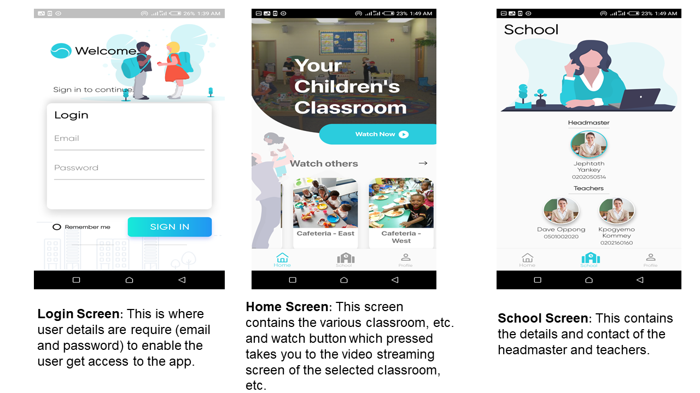
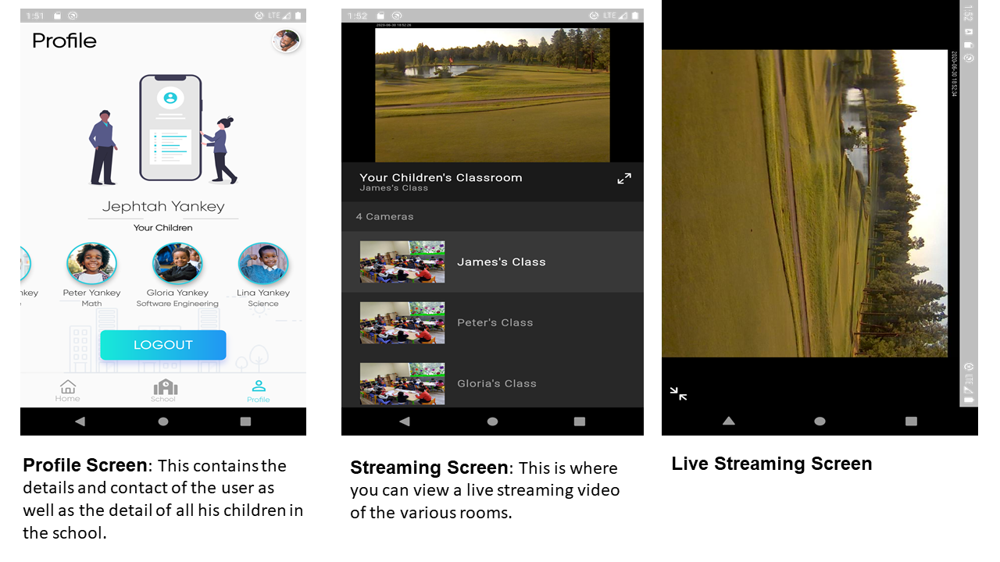

# gods_eye

<h2> Motivation&#127775;</h2>	

This work was done and submitted as a course project for Software Engineering at the Department of Computer Engineering, Kwame Nkrumah Univeristy of Science and Technology, Kumasi, Ghana. The aim of the project is to get an indepth understanding of the process involved in bring up an application in Software Engineering.

## Demo :movie_camera:
Demo video can be found [here](https://youtu.be/0mx5jkTiKyU)

# Feautures of the app &#128187;

# Implementation &#128250; : This is a gif of how the application works 

# Installation &#x1f4e6;
Link for apk download:

[Download apk](https://drive.google.com/drive/folders/1b-KLGeTix7BETogW2dMrxOh1K5Faqqvm)

<h2>Contributing&#127873;</h2>

Pull requests are welcome.

# Contributors &#x1F4D3;
* Gadri Akrong Ebenezer
* Akakpo Senyo Bright
* Harold
* Sese
* Adeboye

For help getting started with Flutter, view our
[online documentation](https://flutter.dev/docs), which offers tutorials,
samples, guidance on mobile development, and a full API reference.
